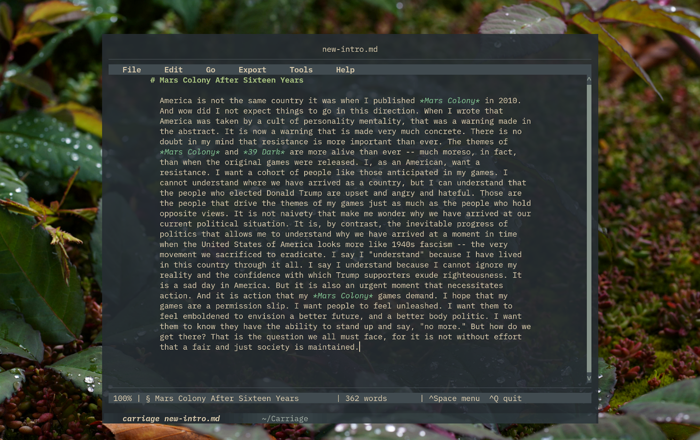

<p align="center">
  
</p>

<h1 align="center">Carriage</h1>

<p align="center">
  <strong>A prose-first Markdown editor for the terminal.</strong>
</p>

> **Carriage is beta software.** It has received extensive automated testing, but it has not yet received the breadth of real-world use expected of a mature text editor. Keep important work backed up or under version control, and do not rely on Carriage as the only copy of a document.

<p align="center">
  
</p>

Carriage is built around writing documents rather than editing source code. It gives ordinary prose a focused, configurable writing area, keeps Markdown structure out of the way where practical, and leaves the file on disk as ordinary, portable Markdown.

The goal is not to hide Markdown or replace it with a proprietary document format. Carriage is intended to make Markdown feel more like a writing environment while preserving the advantages of plain text.

## Writing first

Ordinary paragraphs soft-wrap visually at the configured prose width without inserting line breaks into the Markdown source. On wide terminals, the prose area is centered. ATX heading and list markers can hang into the left margin, and blockquotes use a display-only gutter so the prose itself remains aligned.

Markdown hard line breaks made with two trailing spaces can display a visible `↵` marker. The marker exists only in the editor and is never written to the file.

Carriage takes a deliberately conservative approach to Markdown. It handles straightforward structures it understands and preserves structural, complex, or ambiguous Markdown rather than attempting to repair or reinterpret it.

## Markdown stays Markdown

There is no Carriage document format. A file written in Carriage can be opened in another text editor, tracked in Git, processed with Pandoc, or moved into another Markdown workflow.

Carriage may actively reformat:

- ordinary prose paragraphs
- simple flat ordered and unordered lists
- simple single-level blockquotes

Carriage preserves structures whose layout or meaning should not be guessed, including fenced or indented code, YAML front matter, raw block HTML, reference definitions, complex containers, and unfamiliar or ambiguous Markdown.

Input is read as UTF-8. CRLF and CR line endings are normalized to LF.

## Convert for Carriage

**Edit > Convert for Carriage** normalizes valid Markdown where Carriage can do so safely. It can:

- convert supported Setext headings to ATX headings
- join supported hard-wrapped prose into logical source lines
- renumber straightforward ordered lists from their existing first number
- convert straightforward underscore emphasis to Carriage's preferred asterisk form
- recognize supported pipe tables and simple footnotes as Carriage objects

Conversion is intentionally conservative. Unsupported, complex, or ambiguous structures are preserved rather than repaired.

## Tables

Supported pipe tables become first-class editing objects.

In the prose view, a table is folded into a compact reference such as:

```text
[[Table 1: Movement Rates]]
```

Press `Tab` on the reference to open the table editor. The basic editor can create and edit tables with 2 to 6 columns and 1 to 20 data rows. It supports an optional title, headers, alignment, row and column commands, cell navigation, and visually wrapped cell contents.

Imported tables wider than six columns are preserved as Markdown and participate in saving and recovery, but they cannot be opened in the basic table editor.

On disk, every table remains an ordinary Markdown pipe table. Optional titles use Pandoc table captions.

## Footnotes

Carriage provides first-class support for simple Pandoc-style Markdown footnotes.

Inline references display as sequential numbers such as `[1]` and `[2]`, while supported single-paragraph definitions fold out of the main prose view. Press `Tab` at a reference or folded definition to open the footnote editor.

Adjacent references remain separate atomic objects. Complex or multiline footnotes that Carriage cannot safely model remain ordinary Markdown source.

## Undo and redo

Undo and redo operate across the document, not only the visible prose. Prose changes, table edits, footnote edits, object insertion and deletion, conversion, and the associated object state participate in one chronological undo history.

## Saving and recovery

The Markdown file changes only through explicit **Save** or **Save As**. Carriage does not silently autosave the source file.

Unsaved working state is protected separately in a private recovery journal. The journal is normally updated two seconds after editing becomes idle and at least every ten seconds during sustained editing. After an abnormal exit, Carriage offers to restore or discard recovered work.

Save and Save As use durable atomic replacement. Carriage also:

- detects when another program has changed the file on disk
- leaves an unchanged file untouched rather than replacing it unnecessarily
- preserves supported permissions, ownership, and extended attributes
- refuses unsafe atomic replacement of a file with multiple hard links
- synchronizes completed file and directory updates before reporting success

Recovery reduces the chance of losing unsaved work, but it is not a substitute for backups or version control.

## Opening files

Carriage opens one document at a time. Files larger than 8 MiB require explicit confirmation before loading. The file is decoded incrementally as UTF-8 so large input is not read through one unrestricted allocation.

For an untitled document, Save As suggests a filename from the first recognized ATX heading. The suggestion:

- uses the visible heading text rather than raw Markdown
- uses only the title before a subtitle colon
- removes emphasis, link destinations, code delimiters, HTML tags, and escapes
- neutralizes unsafe filename characters and reserved names
- shortens long titles only at a word boundary, preferring a descriptive ending

## Export

**Export > Hard-Wrapped Markdown** creates a separate Markdown copy wrapped at the configured prose width. It does not modify the working document and does not require Pandoc.

With Pandoc installed, Carriage can export to:

- PDF
- DOCX
- ODT
- standalone HTML
- custom Pandoc formats and arguments

Pandoc exports use an immutable snapshot of the document, run without blocking the editor, protect the destination from external changes, and allow only one Pandoc export at a time.

## Spell checking

The default spell checker is Aspell in Markdown mode. The command is configurable.

Spell checking works on a saved file. If the document contains unsaved changes, Carriage offers to save them first. The terminal is handed to the checker, and the file is reloaded only if the checker exits successfully.

An appropriate Aspell dictionary must be installed for the language being checked.

## Configuration

Carriage creates and reads:

```text
$XDG_CONFIG_HOME/carriage/config.toml
```

If `XDG_CONFIG_HOME` is unset, the path is:

```text
~/.config/carriage/config.toml
```

Carriage has no Preferences dialog. Settings are read at startup and edited manually. The generated file includes:

```toml
[editor]
prose_width = 80

[interface]
scrollbar = true
statusbar = true
mouse = true
hard_break_marker = true

[tools]
pandoc = "pandoc"
spellcheck_command = ["aspell", "--mode=markdown", "check", "{file}"]
```

`prose_width` accepts values from 40 through 160. Invalid TOML or unsupported settings produce a startup warning. A bad individual setting is ignored without discarding valid neighboring settings.

Python 3.11 and newer use the standard-library TOML parser. On Python 3.10, Carriage can read the subset it writes itself; installing the optional `tomli` package enables general TOML parsing.

## Requirements

Carriage requires:

- Python 3.10 or newer
- `prompt_toolkit>=3.0.52,<3.0.54`

The narrow prompt_toolkit range is intentional. Carriage relies on audited prompt_toolkit behavior for cursor geometry, scrolling, mouse handling, and unified undo.

Optional external tools provide additional features:

- **Aspell** and a dictionary package for spell checking
- **Pandoc** for PDF, DOCX, ODT, HTML, and custom export
- a PDF engine supported by Pandoc for PDF export

Carriage is a terminal application. It does not require GTK, Qt, or another graphical toolkit.

## Installation from the development script

Carriage is currently distributed during development as a versioned Python file such as `carriage_v1.157.py`.

Clone or download the repository and open a terminal in its directory. Create a stable `carriage.py` symlink so aliases and commands do not need to change with each development version:

```bash
ln -s carriage_v1.157.py carriage.py
```

Create and activate a virtual environment:

```bash
python3 -m venv .venv
source .venv/bin/activate
```

Install the audited dependency range:

```bash
python -m pip install 'prompt_toolkit>=3.0.52,<3.0.54'
```

Run Carriage:

```bash
python carriage.py
```

Open a document directly:

```bash
python carriage.py document.md
```

Display command-line help or the version:

```bash
python carriage.py --help
python carriage.py --version
```

Use `--` before a filename beginning with a dash:

```bash
python carriage.py -- -draft.md
```

When installing a later development version, update the stable symlink:

```bash
ln -sf carriage_vY.XXX.py carriage.py
```

### Fedora packages

Fedora users can install optional external tools with DNF:

```bash
sudo dnf install aspell aspell-en pandoc-cli pandoc-pdf
```

Fedora also provides `python3-prompt-toolkit`, but its installed version must fall within Carriage's audited range. Check it with:

```bash
python3 -c "import prompt_toolkit; print(prompt_toolkit.__version__)"
```

Use a virtual environment when the system package falls outside the required range.

## Create a `carriage` command

If Carriage uses its own virtual environment, add an alias to `~/.zshrc` or `~/.bashrc`, replacing `/path/to/carriage` with the actual directory:

```bash
alias carriage='/path/to/carriage/.venv/bin/python /path/to/carriage/carriage.py'
```

If the required prompt_toolkit version is installed system-wide:

```bash
alias carriage='python3 /path/to/carriage/carriage.py'
```

Then run:

```bash
carriage
carriage document.md
```

## Essential controls

Press `F10` or `Ctrl+Space` to activate the menu bar. `F1` opens Carriage Help.

| Command | Action |
|---|---|
| `Ctrl+N` | New file |
| `Ctrl+O` | Open file |
| `Ctrl+S` or `F9` | Save |
| `Ctrl+Z` / `Ctrl+R` | Undo / redo |
| `Ctrl+X` / `Ctrl+C` / `Ctrl+V` | Internal cut / copy / paste |
| `F2` / `F3` | Toggle italic / bold on selected text |
| `F4` / `F5` | Insert table / footnote |
| `F6` | Toggle Extend Selection mode |
| `F7` | Spell check |
| `F8` | Renumber the numbered list at the cursor |
| `Ctrl+Home` / `Ctrl+End` | Top / end of document |
| `Alt+Up` / `Alt+Down` | Previous / next ATX section |
| `Tab` | Edit a folded table or footnote at the cursor |

Carriage uses its own internal clipboard. It does not automatically exchange text with the desktop clipboard.

## Documentation

- `CARRIAGE_HELP.md` mirrors the practical built-in help.
- `MARKDOWN_REFERENCE.md` mirrors the built-in Markdown syntax reference.
- `CONFIGURATION.md` documents every current configuration setting.

## Design philosophy

Carriage is deliberately not a full Markdown IDE. It is a writing tool built around a narrower idea: make ordinary Markdown prose comfortable to write in a terminal while keeping the document portable, predictable, and understandable outside the application.

Where Carriage understands the structure, it can provide a better writing interface for it. Where it does not, it preserves the Markdown rather than guessing.

**The file belongs to the writer, not the editor.**

## License

Carriage is licensed under the MIT License. See `LICENSE` for details.
